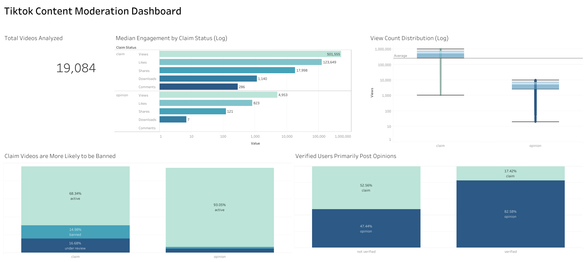

# 📝 TikTok Content Moderation Analysis

An end-to-end data analysis and machine learning project to classify TikTok videos 
as claims or opinions based on user data and engagement metrics.

## Overview
Using a dataset of 19,084 TikTok videos, this project explores whether a video's 
engagement behavior and author status can predict if it is making a claim or 
stating an opinion, a key problem in social media content moderation.

## Tools & Skills
Python, pandas, scikit-learn, numpy, matplotlib, seaborn, Tableau Power BI, Random Forest, 
Logistic Regression, Hyperparameter Optimization, GridSearchCV, Feature Engineering, EDA

## Process

### 1. Data Cleaning
- Dropped 298 rows (~1.5%) with missing values concentrated in the same rows
- Converted engagement columns from float to int
- Removed redundant columns (video ID, index)

### 2. Exploratory Data Analysis
- Claims receive 100x higher raw engagement than opinions (501k vs 4.9k median views)
- 31.7% of claim authors are banned or under review vs only 7% of opinion authors
- Verified users almost exclusively post opinions (991 vs 209 claims)
- All engagement metrics are highly correlated (0.80+); video duration shows 
  near-zero correlation

### 3. Feature Engineering
- Replaced raw engagement counts with per-view ratios (like rate, share rate, 
  download rate, comment rate) to normalize for virality and reduce data leakage
- This reduced the median engagement gap from 100x to a modest difference, 
  forcing the model to learn subtler behavioral patterns

### 4. Modeling
| Model | Accuracy |
|---|---|
| Logistic Regression | 69% |
| Random Forest | 84% |
| Tuned Random Forest | 85% |

### 5. Dashboard
Tableau & Power BI dashboard summarizing key findings across content distribution, 
moderation patterns, and engagement behavior by claim type.

## Key Insights
- Claim videos generate 51% higher like rates than opinion videos
- Claim authors are 4x more likely to be banned or under review
- Mitigating data leakage by using engagement ratios over raw counts reduced 
  an inflated 100% accuracy to a credible and generalizable 84%
- Verified users are strongly associated with opinion content

## Future Improvements
- Here, the video description column was omitted, but NLP can be used to improve the classifier result.
